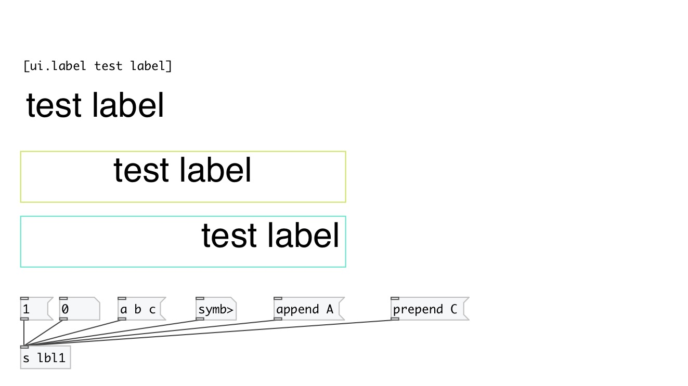

[index](index.html) :: [ui](category_ui.html)
---

# ui.label

###### simple label widget

*доступно с версии:* 0.5

---

## информация
With spaces, text-align, font customization and word wrap

## методы:

* **float**
set label text to given float, but do not change @text property 

* **symbol**
set label text to given symbol, but do not change @text property 

* **list**
set label text to given list separated by spaces, but do not change @text
property 

* **any**
set label text to given message separated by spaces, but do not change @text
property 

* **clear**
clear label text and clear @text property 

* **append**
appends to @text end 

* **set**
set label text and update @text property, so it would be saved in patch 

* **prepend**
insert into beginning of @text 

* **pos**
set UI element position 
  __параметры:__
  - **X** top left x-coord 
    тип: float  
    обязательно: True  

  - **Y** top right y-coord 
    тип: float  
    обязательно: True  

## свойства:

* **@text** 
Получить/установить label text 
_тип:_ symbol 
_по умолчанию:_ Label 

* **@align** 
Получить/установить text align 
_тип:_ symbol 
_варианты:_ left, center, right 
_по умолчанию:_ left 

* **@margin_top** 
Получить/установить text top margin 
_тип:_ int 
_по умолчанию:_ 5 

* **@margin_left** 
Получить/установить text left margin 
_тип:_ int 
_по умолчанию:_ 5 

* **@margin_right** 
Получить/установить text right margin 
_тип:_ int 
_по умолчанию:_ 5 

* **@margin_bottom** 
Получить/установить text bottom margin 
_тип:_ int 
_по умолчанию:_ 5 

* **@send** 
Получить/установить send destination 
_тип:_ symbol 
_по умолчанию:_ (null) 

* **@receive** 
Получить/установить receive source 
_тип:_ symbol 
_по умолчанию:_ (null) 

* **@size** 
Получить/установить element size (width, height pair) 
_тип:_ list 
_по умолчанию:_ 300 47 

* **@pinned** 
Получить/установить pin mode. if 1 - put element to the lowest level 
_тип:_ int 
_варианты:_ 0, 1 
_по умолчанию:_ 1 

* **@text_color** 
Получить/установить text color (list of red, green, blue values in 0-1 range) 
_тип:_ list 
_по умолчанию:_ 0 0 0 1 

* **@background_color** 
Получить/установить element background color (list of red, green, blue values in 0-1 range) 
_тип:_ list 
_по умолчанию:_ 1 1 1 1 

* **@border_color** 
Получить/установить border color (list of red, green, blue values in 0-1 range) 
_тип:_ list 
_по умолчанию:_ 0.6 0.6 0.6 1 

* **@fontsize** 
Получить/установить fontsize 
_тип:_ int 
_минимальное значение:_ 4 
_по умолчанию:_ 32 

* **@fontname** 
Получить/установить fontname 
_тип:_ symbol 
_по умолчанию:_ Helvetica 

* **@fontweight** 
Получить/установить font weight 
_тип:_ symbol 
_варианты:_ normal, bold 
_по умолчанию:_ normal 

* **@fontslant** 
Получить/установить font slant 
_тип:_ symbol 
_варианты:_ roman, italic 
_по умолчанию:_ roman 

## ключевые слова:

[ui](keywords/ui.html)
[label](keywords/label.html)

**Авторы:** Serge Poltavsky

**Лицензия:** GPL3 or later

