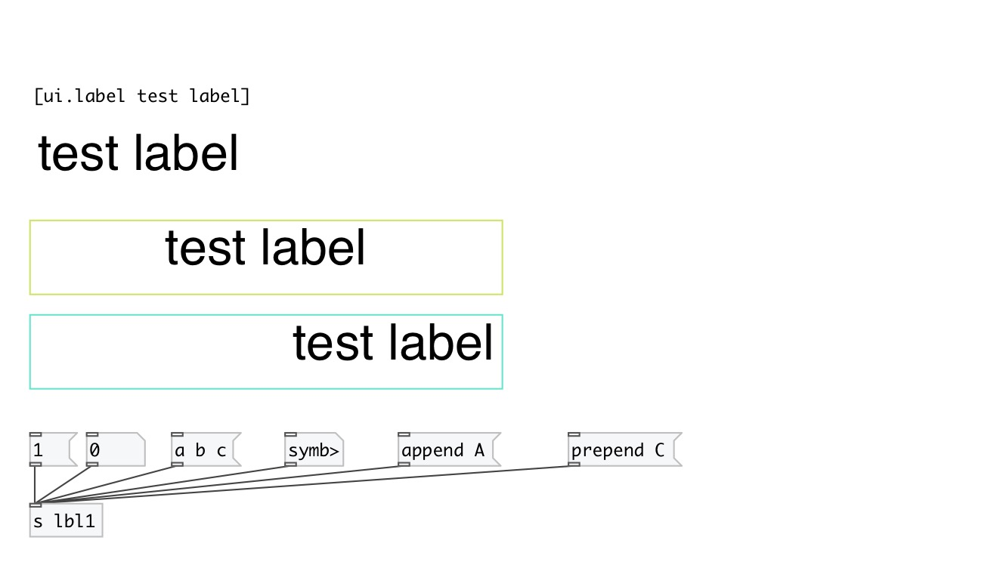

[index](index.html) :: [ui](category_ui.html)
---

# ui.label

###### simple label widget

*доступно с версии:* 0.5

---

## информация
Label object with spaces, text-align, font customization and word-wrap

## аргументы:

* **TEXT**
label text 
_тип:_ list 

## методы:

* **append**
appends to @text end 

* **clear**
clear label text and clear @text property 

* **pos**
set UI element position 
  __параметры:__
  - **X** top left x-coord 
    тип: float  
    обязательно: True  

  - **Y** top right y-coord 
    тип: float  
    обязательно: True  

* **prepend**
insert into beginning of @text 

## свойства:

* **@text** 
Запросить/установить label text 
_тип:_ list 
_по умолчанию:_ Label 

* **@align** 
Запросить/установить text align 
_тип:_ symbol 
_варианты:_ left, center, right 
_по умолчанию:_ left 

* **@margin_top** 
Запросить/установить text top margin 
_тип:_ int 
_по умолчанию:_ 5 

* **@margin_left** 
Запросить/установить text left margin 
_тип:_ int 
_по умолчанию:_ 5 

* **@margin_right** 
Запросить/установить text right margin 
_тип:_ int 
_по умолчанию:_ 5 

* **@margin_bottom** 
Запросить/установить text bottom margin 
_тип:_ int 
_по умолчанию:_ 5 

* **@receive** 
Запросить/установить receive source 
_тип:_ symbol 
_по умолчанию:_ (null) 

* **@size** 
Запросить/установить element size (width, height pair) 
_тип:_ list 
_по умолчанию:_ 300 47 

* **@pinned** 
Запросить/установить pin mode. if 1 - put element to the lowest level 
_тип:_ bool 
_по умолчанию:_ 1 

* **@text_color** 
Запросить/установить text color (list of red, green, blue values in 0-1 range) 
_тип:_ list 
_по умолчанию:_ 0 0 0 1 

* **@background_color** 
Запросить/установить element background color (list of red, green, blue values in 0-1 range) 
_тип:_ list 
_по умолчанию:_ 1 1 1 1 

* **@fontsize** 
Запросить/установить fontsize 
_тип:_ int 
_диапазон:_ 4..100 
_по умолчанию:_ 32 

* **@fontname** 
Запросить/установить fontname 
_тип:_ symbol 
_варианты:_ Courier, DejaVu, Helvetica, Monaco, Times 
_по умолчанию:_ Helvetica 

* **@fontweight** 
Запросить/установить font weight 
_тип:_ symbol 
_варианты:_ normal, bold 
_по умолчанию:_ normal 

* **@fontslant** 
Запросить/установить font slant 
_тип:_ symbol 
_варианты:_ roman, italic 
_по умолчанию:_ roman 

## входы:

* [hidden inlet] set the label text to the given float without changing @text property 
_тип:_ control

## ключевые слова:

[ui](keywords/ui.html)
[label](keywords/label.html)

**Авторы:** Serge Poltavsky

**Лицензия:** GPL3 or later

