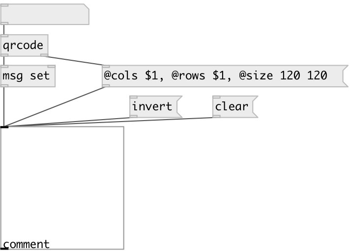

[index](index.html) :: [ui](category_ui.html)
---

# ui.lcd

###### black and white bitmap display

*доступно с версии:* 0.9.7

---

## методы:

* **clear**
clear display 

* **draw left**
moves draw cursor left along x-asis ans draw single pixel 
  __параметры:__
  - **[XOFF]** x-offset. If omitted: 1 
    тип: int  

* **draw right**
moves cursor right along x-asis ans draw single pixel 
  __параметры:__
  - **[XOFF]** x-offset. If omitted: 1 
    тип: int  

* **draw up**
moves draw cursor up along y-asis ans draw single pixel 
  __параметры:__
  - **[YOFF]** y-offset. If omitted: 1 
    тип: int  

* **draw down**
moves draw cursor down along y-asis ans draw single pixel 
  __параметры:__
  - **[YOFF]** y-offset. If omitted: 1 
    тип: int  

* **draw set**
set drawing value 
  __параметры:__
  - **VALUE** draw pixel value (1: black, 0: white) 
    тип: bool  
    обязательно: True  

* **dump**
dumps all object info to Pd console window. 

* **invert**
invert display 

* **pos**
set UI element position 
  __параметры:__
  - **X** top left x-coord 
    тип: float  
    обязательно: True  

  - **Y** top right y-coord 
    тип: float  
    обязательно: True  

* **set**
set display content 
  __параметры:__
  - **PIXELS** pixel values 
    тип: list  
    обязательно: True  

* **set col**
set column content 
  __параметры:__
  - **N** column index 
    тип: int  
    обязательно: True  

  - **PIXELS** column pixel values 
    тип: list  
    обязательно: True  

* **set cursor**
set draw cursor point 
  __параметры:__
  - **X** X-position (from left) 
    тип: int  
    обязательно: True  

  - **Y** Y-position (from top) 
    тип: int  
    обязательно: True  

* **set pixel**
set single pixel 
  __параметры:__
  - **X** X-position (from left) 
    тип: int  
    обязательно: True  

  - **Y** Y-position (from top) 
    тип: int  
    обязательно: True  

  - **VALUE** pixel value 
    тип: bool  
    обязательно: True  

* **set row**
set row content 
  __параметры:__
  - **N** row index 
    тип: int  
    обязательно: True  

  - **PIXELS** row pixel values 
    тип: list  
    обязательно: True  

## свойства:

* **@send** 
Запросить/установить send destination 
_тип:_ symbol 
_по умолчанию:_ (null) 

* **@receive** 
Запросить/установить receive source 
_тип:_ symbol 
_по умолчанию:_ (null) 

* **@size** 
Запросить/установить element size (width, height pair) 
_тип:_ list 
_по умолчанию:_ 64 64 

* **@pinned** 
Запросить/установить pin mode. if 1 - put element to the lowest level 
_тип:_ bool 
_по умолчанию:_ 0 

* **@background_color** 
Запросить/установить element background color (list of red, green, blue values in 0-1 range) 
_тип:_ list 
_по умолчанию:_ 1 1 1 1 

* **@border_color** 
Запросить/установить border color (list of red, green, blue values in 0-1 range) 
_тип:_ list 
_по умолчанию:_ 0.6 0.6 0.6 1 

* **@fontsize** 
Запросить/установить fontsize 
_тип:_ int 
_диапазон:_ 4..100 
_по умолчанию:_ 11 

* **@fontname** 
Запросить/установить fontname 
_тип:_ symbol 
_варианты:_ Courier, DejaVu, Helvetica, Monaco, Times 
_по умолчанию:_ Helvetica 

* **@fontweight** 
Запросить/установить font weight 
_тип:_ symbol 
_варианты:_ normal, bold 
_по умолчанию:_ normal 

* **@fontslant** 
Запросить/установить font slant 
_тип:_ symbol 
_варианты:_ roman, italic 
_по умолчанию:_ roman 

* **@label** 
Запросить/установить label text 
_тип:_ symbol 
_по умолчанию:_ (null) 

* **@label_color** 
Запросить/установить label color in RGB format within 0-1 range, for example: 0.2 0.4 0.1 
_тип:_ list 
_по умолчанию:_ 0 0 0 1 

* **@label_inner** 
Запросить/установить label position (1 - inner, 0 - outer). 
_тип:_ bool 
_по умолчанию:_ 0 

* **@label_align** 
Запросить/установить label horizontal align 
_тип:_ symbol 
_варианты:_ left, center, right 
_по умолчанию:_ left 

* **@label_valign** 
Запросить/установить label vertical align 
_тип:_ symbol 
_варианты:_ top, center, bottom 
_по умолчанию:_ top 

* **@label_side** 
Запросить/установить label snap side 
_тип:_ symbol 
_варианты:_ left, top, right, bottom 
_по умолчанию:_ top 

* **@label_margins** 
Запросить/установить label offset in pixels 
_тип:_ list 
_по умолчанию:_ 0 0 

* **@cols** 
Запросить/установить number of columns 
_тип:_ int 
_диапазон:_ 2..128 
_по умолчанию:_ 8 

* **@rows** 
Запросить/установить number of rows 
_тип:_ int 
_диапазон:_ 2..128 
_по умолчанию:_ 8 

* **@pixels** (readonly)
Запросить number of pixels 
_тип:_ int 
_по умолчанию:_ 64 

## входы:

* command input 
_тип:_ control

## выходы:

* ... 
_тип:_ control

## ключевые слова:

[ui](keywords/ui.html)
[display](keywords/display.html)

**Авторы:** Serge Poltavsky

**Лицензия:** GPL3 or later

