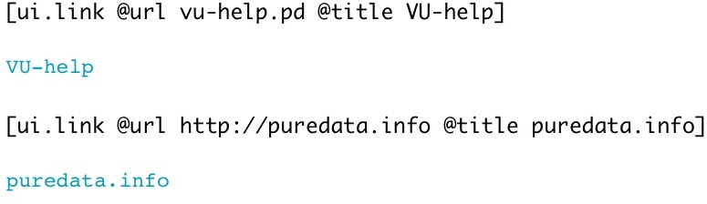

[index](index.html) :: [ui](category_ui.html)
---

# ui.link

###### Hyperlink widget

*доступно с версии:* 0.1

---

## информация
Link allows to open external URLs, not only Pd patches but all kind of URL supported by your OS. If relative file path is given, it searched in current directory, then Pd doc directory and Pd external directories

## аргументы:

* **URL**
@url property value 
_тип:_ symbol 

* **TITLE**
@title property value 
_тип:_ list 

## методы:

* **pos**
set UI element position 
  __параметры:__
  - **X** top left x-coord 
    тип: float  
    обязательно: True  

  - **Y** top right y-coord 
    тип: float  
    обязательно: True  

## свойства:

* **@url** 
Запросить/установить destination url 
_тип:_ symbol 
_по умолчанию:_ &lt;no url&gt; 

* **@title** 
Запросить/установить link title 
_тип:_ symbol 
_по умолчанию:_ &lt;no title&gt; 

* **@pinned** 
Запросить/установить pin mode. if 1 - put element to the lowest level 
_тип:_ bool 
_по умолчанию:_ 0 

* **@hover_color** 
Запросить/установить color when mouse pointer is over element (list of red, green, blue values in
0-1 range) 
_тип:_ list 
_по умолчанию:_ 1 0 0.5 1 

* **@link_color** 
Запросить/установить link color (list of red, green, blue values in 0-1 range) 
_тип:_ list 
_по умолчанию:_ 0 0.625 0.75 1 

* **@fontsize** 
Запросить/установить fontsize 
_тип:_ int 
_диапазон:_ 4..100 
_по умолчанию:_ 11 

* **@fontname** 
Запросить/установить fontname 
_тип:_ symbol 
_варианты:_ Courier, DejaVu, Helvetica, Monaco, Times 
_по умолчанию:_ Helvetica 

* **@fontweight** 
Запросить/установить font weight 
_тип:_ symbol 
_варианты:_ normal, bold 
_по умолчанию:_ normal 

* **@fontslant** 
Запросить/установить font slant 
_тип:_ symbol 
_варианты:_ roman, italic 
_по умолчанию:_ roman 

## ключевые слова:

[ui](keywords/ui.html)
[link](keywords/link.html)

**Авторы:** Serge Poltavsky

**Лицензия:** GPL3 or later

