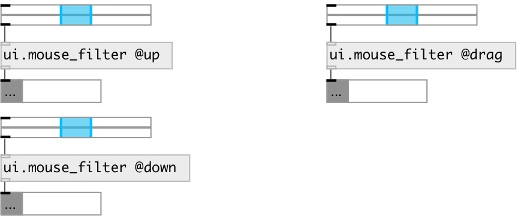

[index](index.html) :: [ui](category_ui.html)
---

# ui.mouse_filter

###### filter mouse events from ui objects

*доступно с версии:* 0.8

---

## информация
pass only specified mouse events from ui.* objects

## свойства:

* **@mouse_up** 
Получить/установить passing a @mouse_up events 
_тип:_ int 
_варианты:_ 0, 1 
_по умолчанию:_ 0 

* **@mouse_down** 
Получить/установить passing a @mouse_down events 
_тип:_ int 
_варианты:_ 0, 1 
_по умолчанию:_ 0 

* **@mouse_leave** 
Получить/установить passing a @mouse_leave events 
_тип:_ int 
_варианты:_ 0, 1 
_по умолчанию:_ 0 

* **@mouse_enter** 
Получить/установить passing a @mouse_enter events 
_тип:_ int 
_варианты:_ 0, 1 
_по умолчанию:_ 0 

* **@mouse_move** 
Получить/установить passing a @mouse_move events 
_тип:_ int 
_варианты:_ 0, 1 
_по умолчанию:_ 0 

* **@mouse_drag** 
Получить/установить passing a @mouse_drag events 
_тип:_ int 
_варианты:_ 0, 1 
_по умолчанию:_ 0 

* **@up** 
Получить/установить alias to @mouse_up 1 property 
_тип:_ alias 
_по умолчанию:_ 0 

* **@down** 
Получить/установить alias to @mouse_down 1 property 
_тип:_ alias 
_по умолчанию:_ 0 

* **@leave** 
Получить/установить alias to @mouse_leave 1 property 
_тип:_ alias 
_по умолчанию:_ 0 

* **@enter** 
Получить/установить alias to @mouse_enter 1 property 
_тип:_ alias 
_по умолчанию:_ 0 

* **@move** 
Получить/установить alias to @mouse_move 1 property 
_тип:_ alias 
_по умолчанию:_ 0 

* **@drag** 
Получить/установить alias to @mouse_drag 1 property 
_тип:_ alias 
_по умолчанию:_ 0 

## входы:

* input messages from ui object 
_тип:_ control

## выходы:

* passed messages from ui object 
_тип:_ control

## ключевые слова:

[ui](keywords/ui.html)
[mouse](keywords/mouse.html)
[filter](keywords/filter.html)
[events](keywords/events.html)

**Смотрите также:**
[\[ui.mouse_route\]](ui.mouse_route.html)
[\[ui.rslider\]](ui.rslider.html)

**Авторы:** Serge Poltavsky

**Лицензия:** GPL3 or later

