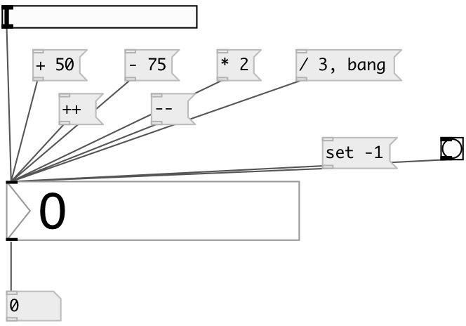

[index](index.html) :: [ui](category_ui.html)
---

# ui.number

###### counterpart of the vanilla [nbx]

*доступно с версии:* 0.1

---

## информация
Display mode: keys &#39;-&#39;(Down) and &#39;+&#39;(Up) increment value. Mouse drag changes value. Default step is 1/pixel. Holding SHIFT divide step by 100. Holding CTRL multiply by 10. Input mode: Double click to enter new value. Accepted keys: -.0123456789. Press ENTER or TAB key to finish. ESCAPE undo input, BACKSPACE removes last character.

## методы:

* **set**
sets slider value without output 
  __параметры:__
  - **V** new value 
    тип: float  
    обязательно: True  

* **++**
increment slider value without output 

* **--**
decrement slider value without output 

* **+**
add value to slider without output 
  __параметры:__
  - **V** added value 
    тип: float  
    обязательно: True  

* **-**
subtract value from slider without output 
  __параметры:__
  - **V** subtracted value 
    тип: float  
    обязательно: True  

* *****
multiply slider value without output 
  __параметры:__
  - **V** multiplied value 
    тип: float  
    обязательно: True  

* **/**
divide slider value without output 
  __параметры:__
  - **V** denominator value 
    тип: float  
    обязательно: True  

* **load**
loads specified preset 
  __параметры:__
  - **IDX** preset index 
    тип: int  
    обязательно: True  

* **store**
stores specified preset 
  __параметры:__
  - **IDX** preset index 
    тип: int  
    обязательно: True  

* **clear**
clears specified preset 
  __параметры:__
  - **IDX** preset index 
    тип: int  
    обязательно: True  

* **interp**
interplolates between presets 
  __параметры:__
  - **IDX** preset fraction index 
    тип: float  
    обязательно: True  

* **pos**
set UI element position 
  __параметры:__
  - **X** top left x-coord 
    тип: float  
    обязательно: True  

  - **Y** top right y-coord 
    тип: float  
    обязательно: True  

## свойства:

* **@min** 
Запросить/установить minimum value 
_тип:_ float 
_по умолчанию:_ -inf 

* **@max** 
Запросить/установить maximum value 
_тип:_ float 
_по умолчанию:_ +inf 

* **@value** 
Запросить/установить widget value 
_тип:_ float 
_по умолчанию:_ 0 

* **@digits** 
Запросить/установить number of digits. If -1 - no fixed digits used 
_тип:_ int 
_диапазон:_ -1..9 
_по умолчанию:_ -1 

* **@presetname** 
Запросить/установить preset name for using with [ui.preset] 
_тип:_ symbol 
_по умолчанию:_ (null) 

* **@send** 
Запросить/установить send destination 
_тип:_ symbol 
_по умолчанию:_ (null) 

* **@receive** 
Запросить/установить receive source 
_тип:_ symbol 
_по умолчанию:_ (null) 

* **@size** 
Запросить/установить element size (width, height pair) 
_тип:_ list 
_по умолчанию:_ 53 15 

* **@pinned** 
Запросить/установить pin mode. if 1 - put element to the lowest level 
_тип:_ bool 
_по умолчанию:_ 0 

* **@active_color** 
Запросить/установить active color (list of red, green, blue values in 0-1 range) 
_тип:_ list 
_по умолчанию:_ 0 0.75 1 1 

* **@text_color** 
Запросить/установить text color (list of red, green, blue values in 0-1 range) 
_тип:_ list 
_по умолчанию:_ 0 0 0 1 

* **@background_color** 
Запросить/установить element background color (list of red, green, blue values in 0-1 range) 
_тип:_ list 
_по умолчанию:_ 0.93 0.93 0.93 1 

* **@border_color** 
Запросить/установить border color (list of red, green, blue values in 0-1 range) 
_тип:_ list 
_по умолчанию:_ 0.6 0.6 0.6 1 

* **@fontsize** 
Запросить/установить fontsize 
_тип:_ int 
_диапазон:_ 4..100 
_по умолчанию:_ 11 

* **@fontname** 
Запросить/установить fontname 
_тип:_ symbol 
_варианты:_ Courier, DejaVu, Helvetica, Monaco, Times 
_по умолчанию:_ Helvetica 

* **@fontweight** 
Запросить/установить font weight 
_тип:_ symbol 
_варианты:_ normal, bold 
_по умолчанию:_ normal 

* **@fontslant** 
Запросить/установить font slant 
_тип:_ symbol 
_варианты:_ roman, italic 
_по умолчанию:_ roman 

## входы:

* outputs current value 
_тип:_ control

## выходы:

* number value 
_тип:_ control

## ключевые слова:

[ui](keywords/ui.html)
[number](keywords/number.html)

**Смотрите также:**
[\[ui.number~\]](ui.number~.html)

**Авторы:** Pierre Guillot, Serge Poltavsky

**Лицензия:** GPL3 or later

