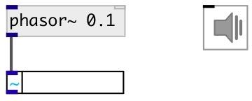

[index](index.html) :: [ui](category_ui.html)
---

# ui.number~

###### counterpart of the vanilla [nbx] for signal

*доступно с версии:* 0.1

---

## информация
Shows one sample from input block via specified interval

## методы:

* **pos**
set UI element position 
  __параметры:__
  - **X** top left x-coord 
    тип: float  
    обязательно: True  

  - **Y** top right y-coord 
    тип: float  
    обязательно: True  

## свойства:

* **@interval** 
Запросить/установить refresh interval 
_тип:_ int 
_единица:_ ms 
_диапазон:_ 20..1000 
_по умолчанию:_ 50 

* **@precision** 
Запросить/установить float precision 
_тип:_ int 
_диапазон:_ 0..16 
_по умолчанию:_ 6 

* **@size** 
Запросить/установить element size (width, height pair) 
_тип:_ list 
_по умолчанию:_ 80 15 

* **@pinned** 
Запросить/установить pin mode. if 1 - put element to the lowest level 
_тип:_ bool 
_по умолчанию:_ 0 

* **@active_color** 
Запросить/установить active color (list of red, green, blue values in 0-1 range) 
_тип:_ list 
_по умолчанию:_ 0 0.75 1 1 

* **@text_color** 
Запросить/установить text color (list of red, green, blue values in 0-1 range) 
_тип:_ list 
_по умолчанию:_ 0.9 0.9 0.9 1 

* **@background_color** 
Запросить/установить element background color (list of red, green, blue values in 0-1 range) 
_тип:_ list 
_по умолчанию:_ 0.3 0.3 0.3 1 

* **@border_color** 
Запросить/установить border color (list of red, green, blue values in 0-1 range) 
_тип:_ list 
_по умолчанию:_ 0 0 0 1 

* **@fontsize** 
Запросить/установить fontsize 
_тип:_ int 
_диапазон:_ 4..100 
_по умолчанию:_ 11 

* **@fontname** 
Запросить/установить fontname 
_тип:_ symbol 
_варианты:_ Courier, DejaVu, Helvetica, Monaco, Times 
_по умолчанию:_ Helvetica 

* **@fontweight** 
Запросить/установить font weight 
_тип:_ symbol 
_варианты:_ normal, bold 
_по умолчанию:_ normal 

* **@fontslant** 
Запросить/установить font slant 
_тип:_ symbol 
_варианты:_ roman, italic 
_по умолчанию:_ roman 

## входы:

* input audio signal 
_тип:_ audio

## выходы:

* signal pass thru 
_тип:_ audio

## ключевые слова:

[ui](keywords/ui.html)
[number](keywords/number.html)

**Смотрите также:**
[\[ui.number\]](ui.number.html)

**Авторы:** Pierre Guillot, Serge Poltavsky

**Лицензия:** GPL3 or later

