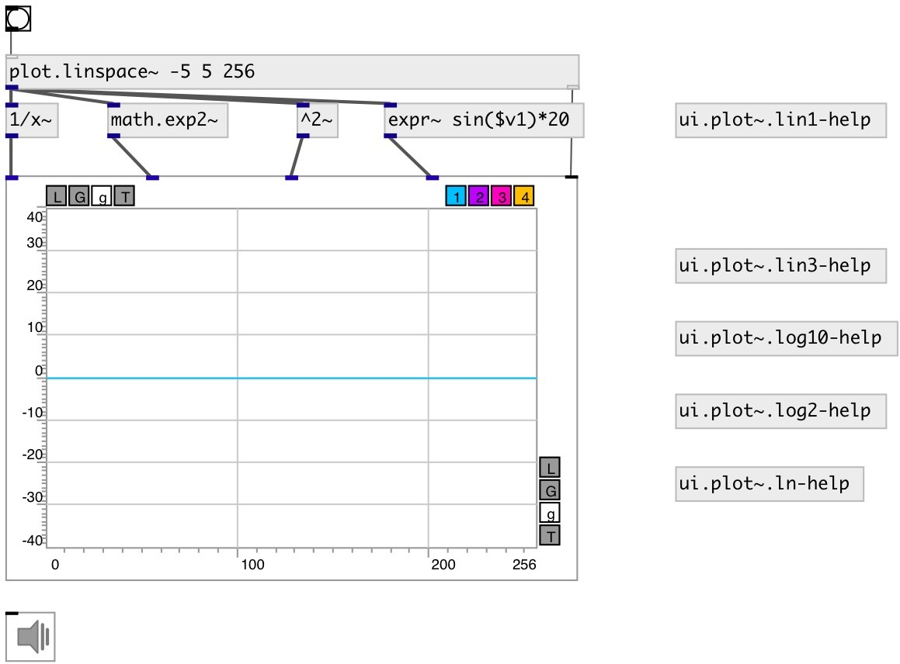

[index](index.html) :: [ui](category_ui.html)
---

# ui.plot~

###### signal plotter

*доступно с версии:* 0.9

---

## методы:

* **plot**
Same as bang: plot default number of samples 

* **pos**
set UI element position 
  __параметры:__
  - **X** top left x-coord 
    тип: float  
    обязательно: True  

  - **Y** top right y-coord 
    тип: float  
    обязательно: True  

## свойства:

* **@n** 
Получить/установить number of inputs 
_тип:_ int 
_диапазон:_ 1..4 
_по умолчанию:_ 1 

* **@ymin** 
Получить/установить minimal y-axis value 
_тип:_ float 
_диапазон:_ -1024..1024 
_по умолчанию:_ -1 

* **@ymax** 
Получить/установить minimal y-axis value 
_тип:_ float 
_диапазон:_ -1024..1024 
_по умолчанию:_ 1 

* **@yauto** 
Получить/установить calculate y-axis range automatically 
_тип:_ int 
_варианты:_ 0, 1 
_по умолчанию:_ 0 

* **@xlabels** 
Получить/установить draw labels on x-axis 
_тип:_ int 
_варианты:_ 0, 1 
_по умолчанию:_ 0 

* **@ylabels** 
Получить/установить draw labels on y-axis 
_тип:_ int 
_варианты:_ 0, 1 
_по умолчанию:_ 0 

* **@xmaj_grid** 
Получить/установить draw major grid lines on x-axis 
_тип:_ int 
_варианты:_ 0, 1 
_по умолчанию:_ 1 

* **@xmin_grid** 
Получить/установить draw minor grid lines on x-axis 
_тип:_ int 
_варианты:_ 0, 1 
_по умолчанию:_ 0 

* **@xmaj_ticks** 
Получить/установить draw minor ticks on x-axis 
_тип:_ int 
_варианты:_ 0, 1 
_по умолчанию:_ 1 

* **@xmin_ticks** 
Получить/установить draw minor ticks on x-axis 
_тип:_ int 
_варианты:_ 0, 1 
_по умолчанию:_ 1 

* **@ymaj_grid** 
Получить/установить draw major grid lines on y-axis 
_тип:_ int 
_варианты:_ 0, 1 
_по умолчанию:_ 1 

* **@ymin_grid** 
Получить/установить draw minor grid lines on y-axis 
_тип:_ int 
_варианты:_ 0, 1 
_по умолчанию:_ 0 

* **@ymaj_ticks** 
Получить/установить draw minor ticks on y-axis 
_тип:_ int 
_варианты:_ 0, 1 
_по умолчанию:_ 1 

* **@ymin_ticks** 
Получить/установить draw minor ticks on y-axis 
_тип:_ int 
_варианты:_ 0, 1 
_по умолчанию:_ 1 

* **@xlabels** 
Получить/установить draw labels on x-axis 
_тип:_ int 
_варианты:_ 0, 1 
_по умолчанию:_ 0 

* **@xlabels** 
Получить/установить draw labels on x-axis 
_тип:_ int 
_варианты:_ 0, 1 
_по умолчанию:_ 0 

* **@mode** 
Получить/установить draw mode 
_тип:_ symbol 
_варианты:_ lines, bars 
_по умолчанию:_ lines 

* **@send** 
Получить/установить send destination 
_тип:_ symbol 
_по умолчанию:_ (null) 

* **@receive** 
Получить/установить receive source 
_тип:_ symbol 
_по умолчанию:_ (null) 

* **@size** 
Получить/установить element size (width, height pair) 
_тип:_ list 
_по умолчанию:_ 200 200 

* **@pinned** 
Получить/установить pin mode. if 1 - put element to the lowest level 
_тип:_ int 
_варианты:_ 0, 1 
_по умолчанию:_ 0 

* **@plot_color0** 
Получить/установить first plot color (list of red, green, blue values in 0-1 range) 
_тип:_ list 
_по умолчанию:_ 0 0.75 1 1 

* **@plot_color1** 
Получить/установить second color (list of red, green, blue values in 0-1 range) 
_тип:_ list 
_по умолчанию:_ 0.75 0 1 1 

* **@plot_color2** 
Получить/установить third color (list of red, green, blue values in 0-1 range) 
_тип:_ list 
_по умолчанию:_ 1 0 0.75 1 

* **@plot_color3** 
Получить/установить fourth color (list of red, green, blue values in 0-1 range) 
_тип:_ list 
_по умолчанию:_ 1 0.75 0 1 

* **@background_color** 
Получить/установить element background color (list of red, green, blue values in 0-1 range) 
_тип:_ list 
_по умолчанию:_ 0.93 0.93 0.93 1 

* **@border_color** 
Получить/установить border color (list of red, green, blue values in 0-1 range) 
_тип:_ list 
_по умолчанию:_ 0.6 0.6 0.6 1 

* **@fontsize** 
Получить/установить fontsize 
_тип:_ int 
_диапазон:_ 4..11 
_по умолчанию:_ 11 

* **@fontname** 
Получить/установить fontname 
_тип:_ symbol 
_по умолчанию:_ Helvetica 

* **@fontweight** 
Получить/установить font weight 
_тип:_ symbol 
_варианты:_ normal, bold 
_по умолчанию:_ normal 

* **@fontslant** 
Получить/установить font slant 
_тип:_ symbol 
_варианты:_ roman, italic 
_по умолчанию:_ roman 

## входы:

* input signal 
_тип:_ audio
* plot default number of samples 
_тип:_ control

## ключевые слова:

[plot](keywords/plot.html)

**Смотрите также:**
[\[array.plot~\]](array.plot~.html)

**Авторы:** Serge Poltavsky

**Лицензия:** GPL3 or later

