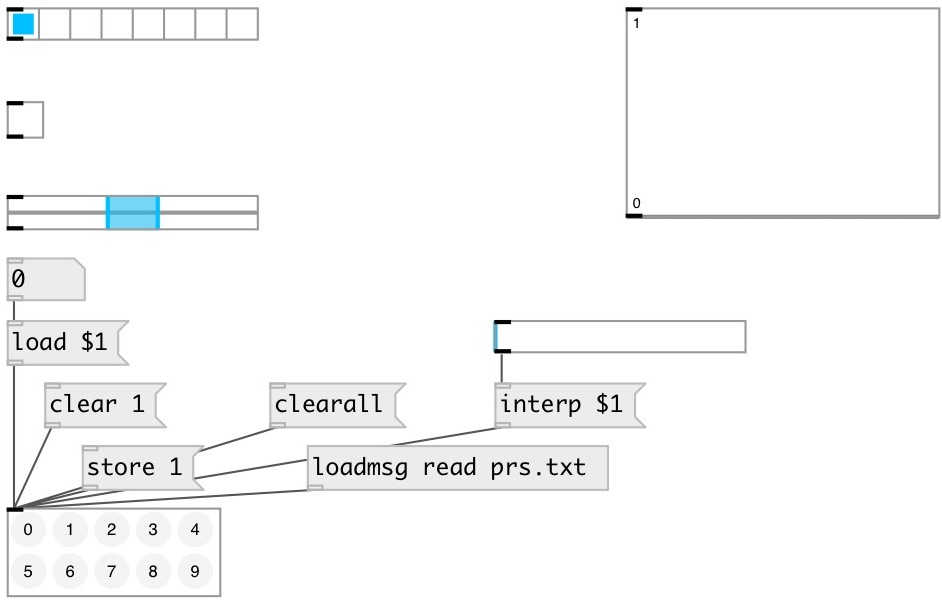

[index](index.html) :: [ui](category_ui.html)
---

# ui.preset

###### Preset manager

*доступно с версии:* 0.1

---

## информация
Saves presets value of UI objects that have @presetname property. Can handle UI objects only on the save canvas, no subpatches or abstractions are supported. NOTE: if no UI widgets with @presetname on canvas - *Shift-click* is disabled. Active slot is highlighted, available slots are dark gray

## методы:

* **clear**
clear specified preset 
  __параметры:__
  - **IDX** preset index 
    тип: int  
    обязательно: True  

* **clearall**
clear all existing presets 

* **load**
loads specified preset 
  __параметры:__
  - **IDX** preset index 
    тип: int  
    обязательно: True  

* **interp**
loads linearry interpolated value between preset, for example: 1.5 means load
interpolated value between preset 1 and 2. 
  __параметры:__
  - **IDX** preset interpolation index 
    тип: float  
    обязательно: True  

* **store**
stores specified preset 
  __параметры:__
  - **IDX** preset index 
    тип: int  
    обязательно: True  

* **read**
read presets from file 
  __параметры:__
  - **PATH** path to preset file 
    тип: symbol  
    обязательно: True  

* **write**
read presets from file 
  __параметры:__
  - **PATH** path to preset file 
    тип: symbol  
    обязательно: True  

* **duplicate**
fill empty presets by coping exiting values 

* **pos**
set UI element position 
  __параметры:__
  - **X** top left x-coord 
    тип: float  
    обязательно: True  

  - **Y** top right y-coord 
    тип: float  
    обязательно: True  

## свойства:

* **@current** (readonly)
Запросить current preset index 
_тип:_ int 
_по умолчанию:_ -1 

* **@receive** 
Запросить/установить receive source 
_тип:_ symbol 
_по умолчанию:_ (null) 

* **@size** 
Запросить/установить element size (width, height pair) 
_тип:_ list 
_по умолчанию:_ 102 42 

* **@pinned** 
Запросить/установить pin mode. if 1 - put element to the lowest level 
_тип:_ bool 
_по умолчанию:_ 0 

* **@active_color** 
Запросить/установить active color (list of red, green, blue values in 0-1 range) 
_тип:_ list 
_по умолчанию:_ 0 0.75 1 1 

* **@text_color** 
Запросить/установить text color (list of red, green, blue values in 0-1 range) 
_тип:_ list 
_по умолчанию:_ 0 0 0 1 

* **@empty_color** 
Запросить/установить empty cell color (list of red, green, blue values in 0-1 range) 
_тип:_ list 
_по умолчанию:_ 0.86 0.86 0.86 1 

* **@stored_color** 
Запросить/установить stored cell color (list of red, green, blue values in 0-1 range) 
_тип:_ list 
_по умолчанию:_ 0.5 0.5 0.5 1 

* **@background_color** 
Запросить/установить element background color (list of red, green, blue values in 0-1 range) 
_тип:_ list 
_по умолчанию:_ 0.93 0.93 0.93 1 

* **@border_color** 
Запросить/установить border color (list of red, green, blue values in 0-1 range) 
_тип:_ list 
_по умолчанию:_ 0.6 0.6 0.6 1 

* **@fontsize** 
Запросить/установить fontsize 
_тип:_ int 
_диапазон:_ 4..100 
_по умолчанию:_ 11 

* **@fontname** 
Запросить/установить fontname 
_тип:_ symbol 
_варианты:_ Courier, DejaVu, Helvetica, Monaco, Times 
_по умолчанию:_ Helvetica 

* **@fontweight** 
Запросить/установить font weight 
_тип:_ symbol 
_варианты:_ normal, bold 
_по умолчанию:_ normal 

* **@fontslant** 
Запросить/установить font slant 
_тип:_ symbol 
_варианты:_ roman, italic 
_по умолчанию:_ roman 

## входы:

_тип:_ control

## ключевые слова:

[ui](keywords/ui.html)
[preset](keywords/preset.html)

**Смотрите также:**
[\[preset.float\]](preset.float.html)
[\[preset.storage\]](preset.storage.html)

**Авторы:** Pierre Guillot, Serge Poltavsky

**Лицензия:** GPL3 or later

