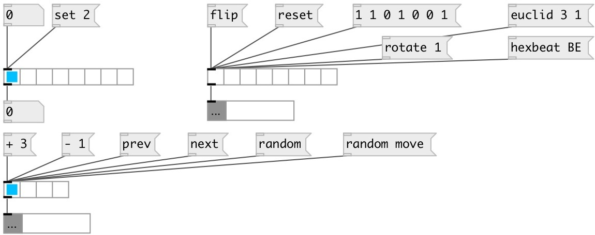

[index](index.html) :: [ui](category_ui.html)
---

# ui.radio

###### counterpart of the vanilla radio toggle

*доступно с версии:* 0.1

---

## информация
[ui.hrd] alias for horizontal radio, [ui.vrd] alias for vertical radio, [ui.hrd*] alias for horizontal radio checklist.

## аргументы:

* **NCELLS**
number of cells 
_тип:_ float 

## методы:

* **set**
sets radio without output 
  __параметры:__
  - **V** new value 
    тип: float  
    обязательно: True  

* **reset**
reset radio (only in checklist mode) 

* **random**
check random cells 

* **flip**
flips radio (only in checklist mode) 

* **next**
moves to next position until last cell is reached (single mode only) 

* **prev**
moves to previous position until first cell is reached (single mode only) 

* **+ STEP**
moves several steps forward on a loop (single mode only) 

* **- STEP**
moves several step backwards on a loop (single mode only) 

* **load**
loads specified preset 
  __параметры:__
  - **IDX** preset index 
    тип: int  
    обязательно: True  

* **store**
stores specified preset 
  __параметры:__
  - **IDX** preset index 
    тип: int  
    обязательно: True  

* **clear**
clears specified preset 
  __параметры:__
  - **IDX** preset index 
    тип: int  
    обязательно: True  

* **interp**
for this object acts as *load*, no interpolation performed 

* **pos**
set UI element position 
  __параметры:__
  - **X** top left x-coord 
    тип: float  
    обязательно: True  

  - **Y** top right y-coord 
    тип: float  
    обязательно: True  

## свойства:

* **@nitems** 
Получить/установить number of items 
_тип:_ int 
_диапазон:_ 2..128 
_по умолчанию:_ 8 

* **@mode** 
Получить/установить check list mode. If true acts as checklist 
_тип:_ int 
_варианты:_ 0, 1 
_по умолчанию:_ 0 

* **@value** 
Получить/установить widget value (float or list) 
_тип:_ list 

* **@presetname** 
Получить/установить preset name for using with [ui.preset] 
_тип:_ symbol 
_по умолчанию:_ (null) 

* **@send** 
Получить/установить send destination 
_тип:_ symbol 
_по умолчанию:_ (null) 

* **@receive** 
Получить/установить receive source 
_тип:_ symbol 
_по умолчанию:_ (null) 

* **@size** 
Получить/установить element size (width, height pair) 
_тип:_ list 
_по умолчанию:_ 120 15 

* **@pinned** 
Получить/установить pin mode. if 1 - put element to the lowest level 
_тип:_ int 
_варианты:_ 0, 1 
_по умолчанию:_ 0 

* **@active_color** 
Получить/установить active color (list of red, green, blue values in 0-1 range) 
_тип:_ list 
_по умолчанию:_ 0 0.75 1 1 

* **@background_color** 
Получить/установить element background color (list of red, green, blue values in 0-1 range) 
_тип:_ list 
_по умолчанию:_ 0.93 0.93 0.93 1 

* **@border_color** 
Получить/установить border color (list of red, green, blue values in 0-1 range) 
_тип:_ list 
_по умолчанию:_ 0.6 0.6 0.6 1 

* **@fontsize** 
Получить/установить fontsize 
_тип:_ int 
_диапазон:_ 4..11 
_по умолчанию:_ 11 

* **@fontname** 
Получить/установить fontname 
_тип:_ symbol 
_по умолчанию:_ Helvetica 

* **@fontweight** 
Получить/установить font weight 
_тип:_ symbol 
_варианты:_ normal, bold 
_по умолчанию:_ normal 

* **@fontslant** 
Получить/установить font slant 
_тип:_ symbol 
_варианты:_ roman, italic 
_по умолчанию:_ roman 

* **@mouse_events** 
Получить/установить mouse events output mode. If on outputs @mouse_down and @mouse_drag events 
_тип:_ int 
_варианты:_ 0, 1 
_по умолчанию:_ 0 

## входы:

* outputs current radio state 
_тип:_ control

## выходы:

* output value 
_тип:_ control

## ключевые слова:

[ui](keywords/ui.html)
[radio](keywords/radio.html)

**Смотрите также:**
[\[ui.matrix\]](ui.matrix.html)

**Авторы:** Pierre Guillot

**Лицензия:** GPL3 or later

