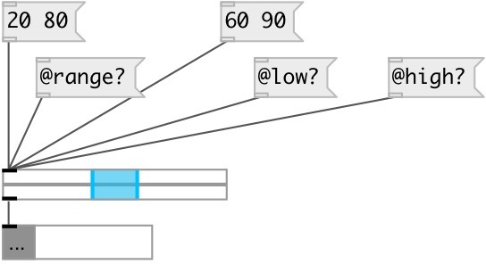

[index](index.html) :: [ui](category_ui.html)
---

# ui.rslider

###### range slider

*доступно с версии:* 0.1

---

## информация
By default outputs messages on mouse click, mouse up and dragging To output messages only on specified event use: @mouse_events=1 and [ui.mouse_filter]

## методы:

* **clear**
clears specified preset 
  __параметры:__
  - **IDX** preset index 
    тип: int  
    обязательно: True  

* **interp**
interplolates between presets 
  __параметры:__
  - **IDX** preset fraction index 
    тип: float  
    обязательно: True  

* **load**
loads specified preset 
  __параметры:__
  - **IDX** preset index 
    тип: int  
    обязательно: True  

* **pos**
set UI element position 
  __параметры:__
  - **X** top left x-coord 
    тип: float  
    обязательно: True  

  - **Y** top right y-coord 
    тип: float  
    обязательно: True  

* **set**
sets slider value without output 
  __параметры:__
  - **V** new value 
    тип: float  
    обязательно: True  

* **store**
stores specified preset 
  __параметры:__
  - **IDX** preset index 
    тип: int  
    обязательно: True  

## свойства:

* **@min** 
Запросить/установить minimum allowed slider value 
_тип:_ float 
_по умолчанию:_ 0 

* **@max** 
Запросить/установить maximum allowed slider value 
_тип:_ float 
_по умолчанию:_ 1 

* **@value** 
Запросить/установить current slider value 
_тип:_ list 

* **@low** 
Запросить/установить low (left) selection value 
_тип:_ float 
_по умолчанию:_ 0.4 

* **@high** 
Запросить/установить max (right) selection value 
_тип:_ float 
_по умолчанию:_ 0.6 

* **@range** (readonly)
Запросить selected slider value 
_тип:_ float 
_минимальное значение:_ 0 
_по умолчанию:_ 0.2 

* **@presetname** 
Запросить/установить preset name for using with [ui.preset] 
_тип:_ symbol 
_по умолчанию:_ (null) 

* **@send** 
Запросить/установить send destination 
_тип:_ symbol 
_по умолчанию:_ (null) 

* **@receive** 
Запросить/установить receive source 
_тип:_ symbol 
_по умолчанию:_ (null) 

* **@size** 
Запросить/установить element size (width, height pair) 
_тип:_ list 
_по умолчанию:_ 120 15 

* **@pinned** 
Запросить/установить pin mode. if 1 - put element to the lowest level 
_тип:_ bool 
_по умолчанию:_ 0 

* **@mouse_events** 
Запросить/установить mouse events output mode. If on outputs @mouse_down, @mouse_up and @mouse_drag
events 
_тип:_ bool 
_по умолчанию:_ 0 

* **@knob_color** 
Запросить/установить knob color (list of red, green, blue values in 0-1 range) 
_тип:_ list 
_по умолчанию:_ 0 0.75 1 1 

* **@background_color** 
Запросить/установить element background color (list of red, green, blue values in 0-1 range) 
_тип:_ list 
_по умолчанию:_ 0.93 0.93 0.93 1 

* **@border_color** 
Запросить/установить border color (list of red, green, blue values in 0-1 range) 
_тип:_ list 
_по умолчанию:_ 0.6 0.6 0.6 1 

* **@fontsize** 
Запросить/установить fontsize 
_тип:_ int 
_диапазон:_ 4..100 
_по умолчанию:_ 11 

* **@fontname** 
Запросить/установить fontname 
_тип:_ symbol 
_варианты:_ Courier, DejaVu, Helvetica, Monaco, Times 
_по умолчанию:_ Helvetica 

* **@fontweight** 
Запросить/установить font weight 
_тип:_ symbol 
_варианты:_ normal, bold 
_по умолчанию:_ normal 

* **@fontslant** 
Запросить/установить font slant 
_тип:_ symbol 
_варианты:_ roman, italic 
_по умолчанию:_ roman 

* **@label** 
Запросить/установить label text 
_тип:_ symbol 
_по умолчанию:_ (null) 

* **@label_color** 
Запросить/установить label color in RGB format within 0-1 range, for example: 0.2 0.4 0.1 
_тип:_ list 
_по умолчанию:_ 0 0 0 1 

* **@label_inner** 
Запросить/установить label position (1 - inner, 0 - outer). 
_тип:_ bool 
_по умолчанию:_ 0 

* **@label_align** 
Запросить/установить label horizontal align 
_тип:_ symbol 
_варианты:_ left, center, right 
_по умолчанию:_ left 

* **@label_valign** 
Запросить/установить label vertical align 
_тип:_ symbol 
_варианты:_ top, center, bottom 
_по умолчанию:_ top 

* **@label_side** 
Запросить/установить label snap side 
_тип:_ symbol 
_варианты:_ left, top, right, bottom 
_по умолчанию:_ top 

* **@label_margins** 
Запросить/установить label offset in pixels 
_тип:_ list 
_по умолчанию:_ 0 0 

## входы:

* outputs current slider state 
_тип:_ control

## выходы:

* output slider range as pair of values 
_тип:_ control

## ключевые слова:

[ui](keywords/ui.html)
[range](keywords/range.html)
[slider](keywords/slider.html)

**Смотрите также:**
[\[ui.slider\]](ui.slider.html)
[\[ui.sliders\]](ui.sliders.html)

**Авторы:** Pierre Guillot, Serge Poltavsky

**Лицензия:** GPL3 or later

