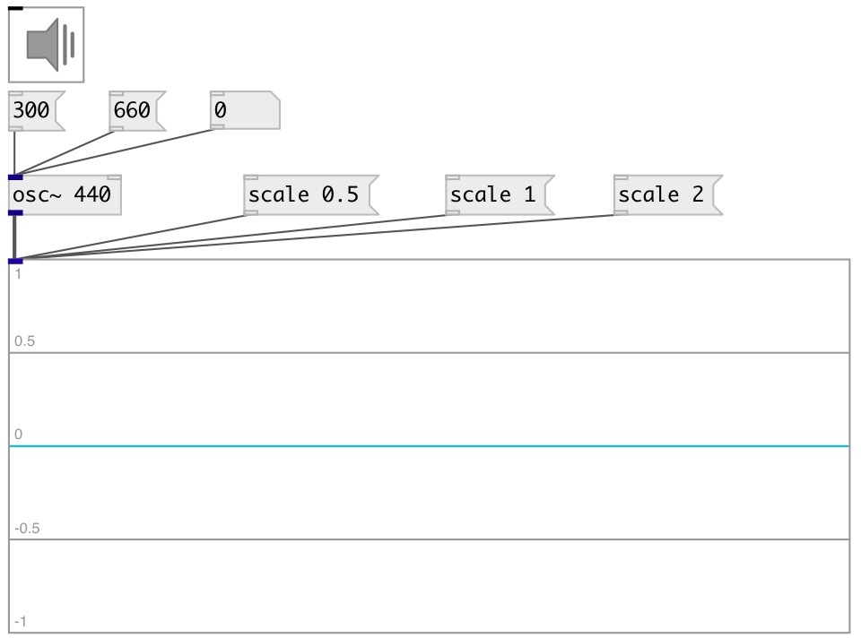

[index](index.html) :: [ui](category_ui.html)
---

# ui.scope~

###### Scope GUI object

*доступно с версии:* 0.1

---

## методы:

* **freeze**
stop/start processing 
  __параметры:__
  - **[V]** 1 - freeze, 0 - unfreeze 
    тип: int  

* **scale**
sets widget scale 
  __параметры:__
  - **[N]** 1 - normal scale, 2 - range from -2..2 (zoomout), 0.1 - range from -0.1..0.1 (zoomin) 
    тип: float  

* **pos**
set UI element position 
  __параметры:__
  - **X** top left x-coord 
    тип: float  
    обязательно: True  

  - **Y** top right y-coord 
    тип: float  
    обязательно: True  

## свойства:

* **@max** 
Получить/установить maximum (top) graph value 
_тип:_ float 
_по умолчанию:_ 1 

* **@min** 
Получить/установить minimum (bottom) graph value 
_тип:_ float 
_по умолчанию:_ -1 

* **@window** 
Получить/установить window size 
_тип:_ int 
_диапазон:_ 512..4096 
_по умолчанию:_ 2048 

* **@refresh** 
Получить/установить approximate refresh rate 
_тип:_ int 
_единица:_ ms 
_диапазон:_ 10..1000 
_по умолчанию:_ 40 

* **@send** 
Получить/установить send destination 
_тип:_ symbol 
_по умолчанию:_ (null) 

* **@receive** 
Получить/установить receive source 
_тип:_ symbol 
_по умолчанию:_ (null) 

* **@size** 
Получить/установить element size (width, height pair) 
_тип:_ list 
_по умолчанию:_ 150 100 

* **@pinned** 
Получить/установить pin mode. if 1 - put element to the lowest level 
_тип:_ int 
_варианты:_ 0, 1 
_по умолчанию:_ 0 

* **@active_color** 
Получить/установить active color (list of red, green, blue values in 0-1 range) 
_тип:_ list 
_по умолчанию:_ 0 0.75 1 1 

* **@background_color** 
Получить/установить element background color (list of red, green, blue values in 0-1 range) 
_тип:_ list 
_по умолчанию:_ 0.93 0.93 0.93 1 

* **@border_color** 
Получить/установить border color (list of red, green, blue values in 0-1 range) 
_тип:_ list 
_по умолчанию:_ 0.6 0.6 0.6 1 

* **@fontsize** 
Получить/установить fontsize 
_тип:_ int 
_диапазон:_ 4..11 
_по умолчанию:_ 11 

* **@fontname** 
Получить/установить fontname 
_тип:_ symbol 
_по умолчанию:_ Helvetica 

* **@fontweight** 
Получить/установить font weight 
_тип:_ symbol 
_варианты:_ normal, bold 
_по умолчанию:_ normal 

* **@fontslant** 
Получить/установить font slant 
_тип:_ symbol 
_варианты:_ roman, italic 
_по умолчанию:_ roman 

## входы:

* signal input 
_тип:_ control

## ключевые слова:

[ui](keywords/ui.html)
[scope](keywords/scope.html)

**Смотрите также:**
[\[ui.spectroscope~\]](ui.spectroscope~.html)

**Авторы:** Alex Nadzharov, Serge Poltavsky

**Лицензия:** GPL3 or later

