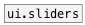
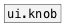

[< справка — содержание](ceammc_lib.html)
---

# ui.slider


Альтернатива стандартному слайдеру

---

[ui.hsl] - сокращение для горизонтального слайдера, [ui.vsl] - для вертикального
<br>


---


```


[5( [50( [set 100( [bang(
|   |    |         |
|   |    |         |  [- 5( [+ 10( [* 2( [/ 3(
|   |    |         |  |     |      |     |
|   |    |         |  |     |      |     | [++, bang( [--, bang(
|   |    |         |  |     |      |     | |          |
[ui.slider @max 127                                   ]
|
|
|
|
|
|
|
|
[F]

            
```

---
аргументы:


---
свойства:

@min: минимальное значение слайдера<br>
@max: максимальное значение слайдера<br>
@mode: режим относительного значения. Если включен, не переходит на значение по нажатию мыши<br>
@midi_channel: канал
            MIDI для привязки значения. 0 - принимает все каналы<br>
@midi_control: 
            номер MIDI контроллера для привязки значения. 0 - значение слайдера не привязано.<br>
@midi_pickup: подхватывать текущее значение по MIDI.
            Если привязка значения слайдера к MIDI активна, в режиме @midi_pickup вам нужно пройти текущее значение слайдера при помощи миди-сообщений. Это предотвращает случайные смены значения при получении сообщений control change<br>
@active_scale: включает режим отрисовки активной шкалы<br>
@value: текущее значение<br>
@show_value: отображать значение (только в горизонтальном режиме)<br>
@value_pos: 
            положение отображаемого значения<br>
@value_precision: 
            количество цифр после запятой в отображаемом значении<br>
@scale: выбор шкалы - логарифмической или линейной.<br>
@presetname: имя пресета для использования с объектом [ui.preset]<br>
@send: адрес для отправки сообщения (send)<br>
@receive: имя источника сообщений (receive)<br>
@size: размер виджета (пара значений: ширина, высота)<br>
@pinned: режим  if 1 - put element
            to the lowest level<br>
@active_color: активный цвет (список значений для красного, зеленого и синего цветов в диапазоне 0..1)<br>
@background_color: цвет фона (список значений для красного, зеленого и синего цветов в диапазоне 0..1)<br>
@border_color: цвет рамки (список значений для красного, зеленого и синего цветов в диапазоне 0..1)<br>
@fontsize: 
            размер шрифта<br>
@fontname: название шрифта<br>
@fontweight: жирный шрифт<br>
@fontslant: курсивный шрифт<br>
@label: содержимое текстовой метки<br>
@label_color: цвет текстовой метки в формате RGB в диапазоне 0-1, например 0.2 0.4 0.1<br>
@label_inner: положение текстовой метки (1 -
            внутри, 0 - снаружи).<br>
@label_align: 
            горизонтальное выравнивание текстовой метки<br>
@label_valign: 
            вертикальное выравнивание текстовой метки<br>
@label_side: 
            сторона текстовой метки, по которой происходит привязка<br>
@label_margins: смещение метки в пикселях<br>

---
смотрите также:<br>
[](ui.slider2d.html)
[](ui.sliders.html)
[](ui.knob.html)
