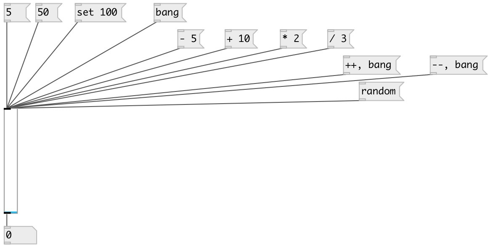

[index](index.html) :: [ui](category_ui.html)
---

# ui.slider

###### counterpart of the vanilla slider

*доступно с версии:* 0.1

---

## информация
[ui.hsl] is alias for horizontal slider, [ui.vsl] - for vertical

## аргументы:

* **min**
min value 
_тип:_ float 

* **max**
max value 
_тип:_ float 

## методы:

* **set**
sets slider value without output 
  __параметры:__
  - **V** new float value or &#39;random&#39; 
    тип: atom  
    обязательно: True  

* **++**
increment slider value without output 

* **--**
decrement slider value without output 

* **+**
add value to slider without output 
  __параметры:__
  - **V** added value 
    тип: float  
    обязательно: True  

* **-**
subtract value from slider without output 
  __параметры:__
  - **V** subtracted value 
    тип: float  
    обязательно: True  

* *****
multiply slider value without output 
  __параметры:__
  - **V** multiplied value 
    тип: float  
    обязательно: True  

* **/**
divide slider value without output 
  __параметры:__
  - **V** denominator value 
    тип: float  
    обязательно: True  

* **random**
set slider to random value and output 

* **load**
loads specified preset 
  __параметры:__
  - **IDX** preset index 
    тип: int  
    обязательно: True  

* **store**
stores specified preset 
  __параметры:__
  - **IDX** preset index 
    тип: int  
    обязательно: True  

* **clear**
clears specified preset 
  __параметры:__
  - **IDX** preset index 
    тип: int  
    обязательно: True  

* **interp**
interplolates between presets 
  __параметры:__
  - **IDX** preset fraction index 
    тип: float  
    обязательно: True  

* **pos**
set UI element position 
  __параметры:__
  - **X** top left x-coord 
    тип: float  
    обязательно: True  

  - **Y** top right y-coord 
    тип: float  
    обязательно: True  

## свойства:

* **@min** 
Запросить/установить minimum slider value 
_тип:_ float 
_по умолчанию:_ 0 

* **@max** 
Запросить/установить maximum slider value 
_тип:_ float 
_по умолчанию:_ 1 

* **@mode** 
Запросить/установить relative mode. Do not jump on click to value 
_тип:_ bool 
_по умолчанию:_ 0 

* **@midi_channel** 
Запросить/установить binded MIDI channel. 0 means listen to all channels 
_тип:_ int 
_диапазон:_ 0..16 
_по умолчанию:_ 0 

* **@midi_control** 
Запросить/установить binded MIDI controller number. -1 means not binded to any controller. 
_тип:_ int 
_диапазон:_ -1..127 
_по умолчанию:_ -1 

* **@midi_pickup** 
Запросить/установить pickup current value. If slider is binded to value, first time you should pass
over this value to make binding. It prevents from sudden value change on first
control change 
_тип:_ bool 
_по умолчанию:_ 1 

* **@active_scale** 
Запросить/установить if should draw active scale 
_тип:_ bool 
_по умолчанию:_ 0 

* **@value** 
Запросить/установить current value 
_тип:_ float 
_по умолчанию:_ 0 

* **@show_value** 
Запросить/установить show value (in horizontal mode only) 
_тип:_ bool 
_по умолчанию:_ 0 

* **@value_pos** 
Запросить/установить value position 
_тип:_ symbol 
_варианты:_ left, center, right 
_по умолчанию:_ center 

* **@value_precision** 
Запросить/установить number of digits shown after decimal point 
_тип:_ int 
_диапазон:_ 0..7 
_по умолчанию:_ 2 

* **@scale** 
Запросить/установить scale mode. Linear or logarithmic. 
_тип:_ symbol 
_варианты:_ linear, log 
_по умолчанию:_ linear 

* **@presetname** 
Запросить/установить preset name for using with [ui.preset] 
_тип:_ symbol 
_по умолчанию:_ (null) 

* **@send** 
Запросить/установить send destination 
_тип:_ symbol 
_по умолчанию:_ (null) 

* **@receive** 
Запросить/установить receive source 
_тип:_ symbol 
_по умолчанию:_ (null) 

* **@size** 
Запросить/установить element size (width, height pair) 
_тип:_ list 
_по умолчанию:_ 15 120 

* **@pinned** 
Запросить/установить pin mode. if 1 - put element to the lowest level 
_тип:_ bool 
_по умолчанию:_ 0 

* **@mouse_events** 
Запросить/установить mouse events output mode. If on outputs @mouse_down, @mouse_up and @mouse_drag
events 
_тип:_ bool 
_по умолчанию:_ 0 

* **@knob_color** 
Запросить/установить knob color (list of red, green, blue values in 0-1 range) 
_тип:_ list 
_по умолчанию:_ 0 0.75 1 1 

* **@background_color** 
Запросить/установить element background color (list of red, green, blue values in 0-1 range) 
_тип:_ list 
_по умолчанию:_ 0.93 0.93 0.93 1 

* **@border_color** 
Запросить/установить border color (list of red, green, blue values in 0-1 range) 
_тип:_ list 
_по умолчанию:_ 0.6 0.6 0.6 1 

* **@text_color** 
Запросить/установить value text color (list of red, green, blue values in 0-1 range) 
_тип:_ list 
_по умолчанию:_ 0 0 0 1 

* **@fontsize** 
Запросить/установить fontsize 
_тип:_ int 
_диапазон:_ 4..100 
_по умолчанию:_ 11 

* **@fontname** 
Запросить/установить fontname 
_тип:_ symbol 
_варианты:_ Courier, DejaVu, Helvetica, Monaco, Times 
_по умолчанию:_ Helvetica 

* **@fontweight** 
Запросить/установить font weight 
_тип:_ symbol 
_варианты:_ normal, bold 
_по умолчанию:_ normal 

* **@fontslant** 
Запросить/установить font slant 
_тип:_ symbol 
_варианты:_ roman, italic 
_по умолчанию:_ roman 

* **@label** 
Запросить/установить label text 
_тип:_ symbol 
_по умолчанию:_ (null) 

* **@label_color** 
Запросить/установить label color in RGB format within 0-1 range, for example: 0.2 0.4 0.1 
_тип:_ list 
_по умолчанию:_ 0 0 0 1 

* **@label_inner** 
Запросить/установить label position (1 - inner, 0 - outer). 
_тип:_ bool 
_по умолчанию:_ 0 

* **@label_align** 
Запросить/установить label horizontal align 
_тип:_ symbol 
_варианты:_ left, center, right 
_по умолчанию:_ left 

* **@label_valign** 
Запросить/установить label vertical align 
_тип:_ symbol 
_варианты:_ top, center, bottom 
_по умолчанию:_ top 

* **@label_side** 
Запросить/установить label snap side 
_тип:_ symbol 
_варианты:_ left, top, right, bottom 
_по умолчанию:_ top 

* **@label_margins** 
Запросить/установить label offset in pixels 
_тип:_ list 
_по умолчанию:_ 0 0 

## входы:

* outputs current slider state 
_тип:_ control

## выходы:

* output value 
_тип:_ control

## ключевые слова:

[ui](keywords/ui.html)
[slider](keywords/slider.html)

**Смотрите также:**
[\[ui.slider2d\]](ui.slider2d.html)
[\[ui.sliders\]](ui.sliders.html)
[\[ui.knob\]](ui.knob.html)

**Авторы:** Pierre Guillot

**Лицензия:** GPL3 or later

