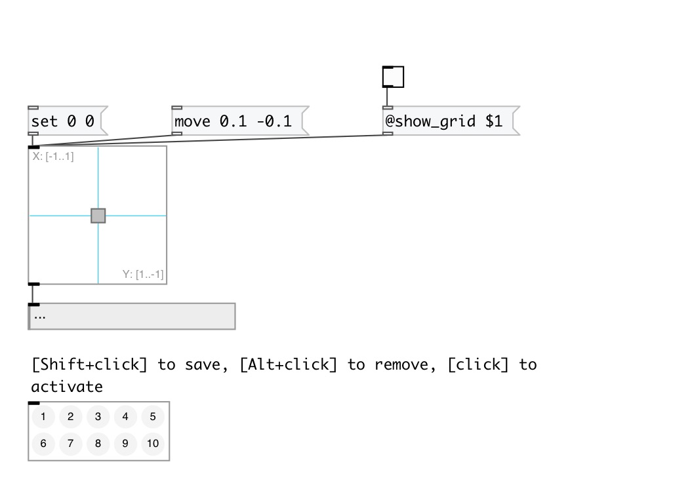
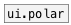

[< справка — содержание](index.html)
---

# ui.slider2d

виджет - слайдер 2D

---

виджет - слайдер 2D
 

---

---
аргументы:

---
свойства:

@x_left: крайнее левое значение по оси x 
@x_right: крайнее правое значение по оси x 
@y_top: верхнее значение по оси y 
@y_bottom: нижнее значение по оси y 
@x_range: диапазон значения по оси x 
@y_range: диапазон значения по оси y 
@x_value: значение слайдера по оси x 
@y_value: значение слайдера по оси y 
@show_range: если установлено, показывает диапазон слайдера 
@show_grid: если установлено, показывает сетку 
@presetname: preset name for using with
            [ui.preset] 
@send: send destination 
@receive: receive source 
@size: element size (width, height
            pair) 
@pinned: pin mode. if 1 - put element
            to the lowest level 
@mouse_events: mouse events output
            mode. If on outputs @mouse_down, @mouse_up and @mouse_drag events 
@background_color: element
            background color (list of red, green, blue values in 0-1 range) 
@border_color: border color (list
            of red, green, blue values in 0-1 range) 
@fontsize: 
            fontsize 
@fontname: fontname 
@fontweight: font
            weight 
@fontslant: font
            slant 
@label: label text 
@label_color: label color in RGB format
            within 0-1 range, for example: 0.2 0.4 0.1 
@label_inner: label position (1 -
            inner, 0 - outer). 
@label_align: 
            label horizontal align 
@label_valign: 
            label vertical align 
@label_side: 
            label snap side 
@label_margins: label offset in
            pixels 

---
смотрите также: 

