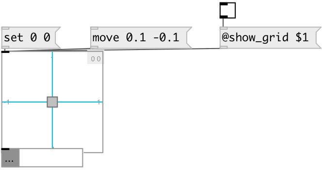

[index](index.html) :: [ui](category_ui.html)
---

# ui.slider2d

###### 2D slider widget

*доступно с версии:* 0.1

---

## методы:

* **dump**
dumps all object info to Pd console window 

* **set**
sets slider position without output 
  __параметры:__
  - **X** x-position 
    тип: float  
    обязательно: True  

  - **Y** y-position 
    тип: float  
    обязательно: True  

* **move**
move slider by given offset 
  __параметры:__
  - **X** x-offset 
    тип: float  
    обязательно: True  

  - **Y** y-offset 
    тип: float  
    обязательно: True  

* **load**
loads specified preset 
  __параметры:__
  - **IDX** preset index 
    тип: int  
    обязательно: True  

* **store**
stores specified preset 
  __параметры:__
  - **IDX** preset index 
    тип: int  
    обязательно: True  

* **clear**
clears specified preset 
  __параметры:__
  - **IDX** preset index 
    тип: int  
    обязательно: True  

* **interp**
interplolates between presets 
  __параметры:__
  - **IDX** preset fraction index 
    тип: float  
    обязательно: True  

* **pos**
set UI element position 
  __параметры:__
  - **X** top left x-coord 
    тип: float  
    обязательно: True  

  - **Y** top right y-coord 
    тип: float  
    обязательно: True  

## свойства:

* **@x_left** 
Запросить/установить leftmost x-value 
_тип:_ float 
_по умолчанию:_ -1 

* **@x_right** 
Запросить/установить rightmost x-value 
_тип:_ float 
_по умолчанию:_ 1 

* **@y_top** 
Запросить/установить top y-value 
_тип:_ float 
_по умолчанию:_ 1 

* **@y_bottom** 
Запросить/установить bottom y-value 
_тип:_ float 
_по умолчанию:_ -1 

* **@x_range** (readonly)
Запросить abs x-value range 
_тип:_ float 
_по умолчанию:_ 2 

* **@y_range** (readonly)
Запросить abs y-value range 
_тип:_ float 
_по умолчанию:_ 2 

* **@x_value** 
Запросить/установить slider x-value 
_тип:_ float 
_по умолчанию:_ 0 

* **@y_value** 
Запросить/установить slider y-value 
_тип:_ float 
_по умолчанию:_ 0 

* **@show_range** 
Запросить/установить if show slider range 
_тип:_ bool 
_по умолчанию:_ 1 

* **@show_grid** 
Запросить/установить if show grid 
_тип:_ bool 
_по умолчанию:_ 0 

* **@presetname** 
Запросить/установить preset name for using with [ui.preset] 
_тип:_ symbol 
_по умолчанию:_ (null) 

* **@send** 
Запросить/установить send destination 
_тип:_ symbol 
_по умолчанию:_ (null) 

* **@receive** 
Запросить/установить receive source 
_тип:_ symbol 
_по умолчанию:_ (null) 

* **@size** 
Запросить/установить element size (width, height pair) 
_тип:_ list 
_по умолчанию:_ 100 100 

* **@pinned** 
Запросить/установить pin mode. if 1 - put element to the lowest level 
_тип:_ bool 
_по умолчанию:_ 0 

* **@mouse_events** 
Запросить/установить mouse events output mode. If on outputs @mouse_down, @mouse_up and @mouse_drag
events 
_тип:_ bool 
_по умолчанию:_ 0 

* **@background_color** 
Запросить/установить element background color (list of red, green, blue values in 0-1 range) 
_тип:_ list 
_по умолчанию:_ 0.93 0.93 0.93 1 

* **@border_color** 
Запросить/установить border color (list of red, green, blue values in 0-1 range) 
_тип:_ list 
_по умолчанию:_ 0.6 0.6 0.6 1 

* **@fontsize** 
Запросить/установить fontsize 
_тип:_ int 
_диапазон:_ 4..100 
_по умолчанию:_ 11 

* **@fontname** 
Запросить/установить fontname 
_тип:_ symbol 
_варианты:_ Courier, DejaVu, Helvetica, Monaco, Times 
_по умолчанию:_ Helvetica 

* **@fontweight** 
Запросить/установить font weight 
_тип:_ symbol 
_варианты:_ normal, bold 
_по умолчанию:_ normal 

* **@fontslant** 
Запросить/установить font slant 
_тип:_ symbol 
_варианты:_ roman, italic 
_по умолчанию:_ roman 

* **@label** 
Запросить/установить label text 
_тип:_ symbol 
_по умолчанию:_ (null) 

* **@label_color** 
Запросить/установить label color in RGB format within 0-1 range, for example: 0.2 0.4 0.1 
_тип:_ list 
_по умолчанию:_ 0 0 0 1 

* **@label_inner** 
Запросить/установить label position (1 - inner, 0 - outer). 
_тип:_ bool 
_по умолчанию:_ 0 

* **@label_align** 
Запросить/установить label horizontal align 
_тип:_ symbol 
_варианты:_ left, center, right 
_по умолчанию:_ left 

* **@label_valign** 
Запросить/установить label vertical align 
_тип:_ symbol 
_варианты:_ top, center, bottom 
_по умолчанию:_ top 

* **@label_side** 
Запросить/установить label snap side 
_тип:_ symbol 
_варианты:_ left, top, right, bottom 
_по умолчанию:_ top 

* **@label_margins** 
Запросить/установить label offset in pixels 
_тип:_ list 
_по умолчанию:_ 0 0 

## входы:

* outputs slider position 
_тип:_ control

## выходы:

* list output of two values: X and Y 
_тип:_ control

## ключевые слова:

[ui](keywords/ui.html)
[slider](keywords/slider.html)

**Смотрите также:**
[\[ui.slider\]](ui.slider.html)
[\[ui.polar\]](ui.polar.html)

**Авторы:** Alex Nadzharov, Serge Poltavsky

**Лицензия:** GPL3 or later

