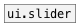

[< справка — содержание](index.html)
---

# ui.sliders


Виджет - мультислайдер

---

<br>


---


```


[1 2 3 4 5( [0 30(              [F]         [T]
|           |                   |           |
|  [B]      [list.seq]          [@count $1( [@auto_range $1(
|  |        |                   |           |
|  |        | [F]               |           |
|  |        | |                 |           |   [select 4(
|  |        | [set slider 4 $1( |           |   |
|  |        | |                 |           |   |
|  |        | |                 |           |   |  /*vertical slider*/
|  |        | |                 |           |   |
[ui.sliders       @max 10  @presetname sl-help  ]  [ui.sliders @size 100 150]
|
|
|
|
|
|
|
[ui.display @display_type=1]

            
```

---
аргументы:

N: количество слайдеров<br>

---
свойства:

@count: количество слайдеров<br>
@min: минимальное значение<br>
@max: максимальное значение<br>
@range: диапазон значений<br>
@value: значения слайдеров<br>
@auto_range: если равно 1, устанавливает количество слайдеров равным количеству элементов во входящем списке<br>
@show_range: если равно 1, показывает диапазон значений слайдеров<br>
@presetname: имя пресета для использования с объектом [ui.preset]<br>
@send: адрес для отправки сообщения (send)<br>
@receive: имя источника сообщений (receive)<br>
@size: размер виджета (пара значений: ширина, высота)<br>
@pinned: режим  if 1 - put element
            to the lowest level<br>
@active_color: активный цвет (список значений для красного, зеленого и синего цветов в диапазоне 0..1)<br>
@background_color: цвет фона (список значений для красного, зеленого и синего цветов в диапазоне 0..1)<br>
@border_color: цвет рамки (список значений для красного, зеленого и синего цветов в диапазоне 0..1)<br>
@fontsize: 
            размер шрифта<br>
@fontname: название шрифта<br>
@fontweight: жирный шрифт<br>
@fontslant: курсивный шрифт<br>
@label: содержимое текстовой метки<br>
@label_color: цвет текстовой метки в формате RGB в диапазоне 0-1, например 0.2 0.4 0.1<br>
@label_inner: положение текстовой метки (1 -
            внутри, 0 - снаружи).<br>
@label_align: 
            горизонтальное выравнивание текстовой метки<br>
@label_valign: 
            вертикальное выравнивание текстовой метки<br>
@label_side: 
            сторона текстовой метки, по которой происходит привязка<br>
@label_margins: смещение метки в пикселях<br>

---
смотрите также:<br>
[](ui.slider.html)
[](ui.preset.html)
