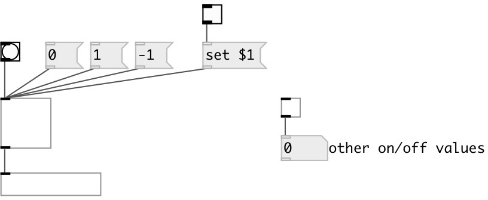

[index](index.html) :: [ui](category_ui.html)
---

# ui.toggle

###### modern toggle widget

*доступно с версии:* 0.1

---

## информация
This is the ceammc counterpart of the vanilla toggle

## методы:

* **dump**
dumps all object info to Pd console window 

* **set**
sets toggle state without output 

* **load**
loads specified preset 
  __параметры:__
  - **IDX** preset index 
    тип: int  
    обязательно: True  

* **store**
stores specified preset 
  __параметры:__
  - **IDX** preset index 
    тип: int  
    обязательно: True  

* **clear**
clears specified preset 
  __параметры:__
  - **IDX** preset index 
    тип: int  
    обязательно: True  

* **interp**
for this object acts as *load*, no interpolation performed 

* **pos**
set UI element position 
  __параметры:__
  - **X** top left x-coord 
    тип: float  
    обязательно: True  

  - **Y** top right y-coord 
    тип: float  
    обязательно: True  

## свойства:

* **@value** 
Запросить/установить widget logical value 
_тип:_ float 
_варианты:_ 0, 1 
_по умолчанию:_ 0 

* **@on_value** 
Запросить/установить output on value 
_тип:_ float 
_по умолчанию:_ 1 

* **@off_value** 
Запросить/установить output off value 
_тип:_ float 
_по умолчанию:_ 0 

* **@midi_channel** 
Запросить/установить binded MIDI channel. 0 means listen to all channels 
_тип:_ int 
_диапазон:_ 0..16 
_по умолчанию:_ 0 

* **@midi_control** 
Запросить/установить binded MIDI controller number. -1 means not binded to any controller. 
_тип:_ int 
_диапазон:_ -1..127 
_по умолчанию:_ -1 

* **@presetname** 
Запросить/установить preset name for using with [ui.preset] 
_тип:_ symbol 
_по умолчанию:_ (null) 

* **@send** 
Запросить/установить send destination 
_тип:_ symbol 
_по умолчанию:_ (null) 

* **@receive** 
Запросить/установить receive source 
_тип:_ symbol 
_по умолчанию:_ (null) 

* **@size** 
Запросить/установить element size (width, height pair) 
_тип:_ list 
_по умолчанию:_ 15 15 

* **@pinned** 
Запросить/установить pin mode. if 1 - put element to the lowest level 
_тип:_ bool 
_по умолчанию:_ 0 

* **@active_color** 
Запросить/установить active color (list of red, green, blue values in 0-1 range) 
_тип:_ list 
_по умолчанию:_ 0 0.75 1 1 

* **@background_color** 
Запросить/установить element background color (list of red, green, blue values in 0-1 range) 
_тип:_ list 
_по умолчанию:_ 0.93 0.93 0.93 1 

* **@border_color** 
Запросить/установить border color (list of red, green, blue values in 0-1 range) 
_тип:_ list 
_по умолчанию:_ 0.6 0.6 0.6 1 

* **@fontsize** 
Запросить/установить fontsize 
_тип:_ int 
_диапазон:_ 4..100 
_по умолчанию:_ 11 

* **@fontname** 
Запросить/установить fontname 
_тип:_ symbol 
_варианты:_ Courier, DejaVu, Helvetica, Monaco, Times 
_по умолчанию:_ Helvetica 

* **@fontweight** 
Запросить/установить font weight 
_тип:_ symbol 
_варианты:_ normal, bold 
_по умолчанию:_ normal 

* **@fontslant** 
Запросить/установить font slant 
_тип:_ symbol 
_варианты:_ roman, italic 
_по умолчанию:_ roman 

## входы:

* change toggle state 
_тип:_ control

## выходы:

* outputs @on_value or @off_value (by default 0 or 1) 
_тип:_ control

## ключевые слова:

[ui](keywords/ui.html)
[toggle](keywords/toggle.html)

**Смотрите также:**
[\[ui.bang\]](ui.bang.html)

**Авторы:** Pierre Guillot, Serge Poltavsky

**Лицензия:** GPL3 or later

