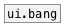

[< reference home](ceammc_lib.html)
---

# ui.toggle


обновленный виджет-переключатель

---

Это обновленный вариант стандарной кнопки (toggle)<br>


---


```


                  [T]
                  |
[B] [0( [1( [-1(  [set $1(
|   |   |   |     |
|   |   |   |     |
[ui.toggle @size=40x40]
|
|
[m set]
|
[ (

            
```

---
arguments:


---
properties:

@value: текущее значение<br>
@presetname: название пресета для использования с
            [ui.preset]<br>
@send: адрес для отправки сообщения (send)<br>
@receive: имя источника сообщений (receive)<br>
@size: размер виджета (пара значений: ширина, высота)<br>
@pinned: режим  if 1 - put element
            to the lowest level<br>
@active_color: активный цвет (список значений для красного, зеленого и синего цветов в диапазоне 0..1)<br>
@background_color: element
            background color (list of red, green, blue values in 0-1 range)<br>
@border_color: border color (list
            of red, green, blue values in 0-1 range)<br>
@fontsize: 
            размер шрифта<br>
@fontname: название шрифта<br>
@fontweight: жирный шрифт<br>
@fontslant: курсивный шрифт<br>

---
see also:<br>
[](ui.bang.html)
