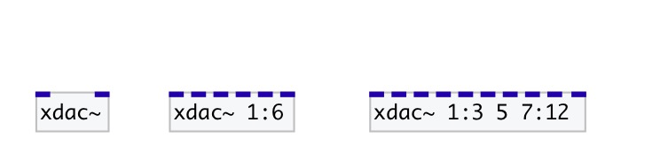

[index](index.html) :: [base](category_base.html)
---

# xdac~

###### dac~ with channel ranges

*доступно с версии:* 0.8

---

## аргументы:

* **OUTS**
list of output channels: single channel number or X:Y range, that means from X
channel to Y (including last one). If not specified - using 1 and 2 out
channels 
_тип:_ list 

## методы:

* **reverse**
reverse output channels order 

* **rotate**
rotate output channels counter clockwise 
  __параметры:__
  - **N** number of rotation steps, can be negative 
    тип: int  
    обязательно: True  

* **shuffle**
shuffle output channels order 

* **side2circle**
map left/right side pairs to counter clockwise layout 

## свойства:

* **@channels** 
Запросить/установить list of mapped channels 
_тип:_ list 
_по умолчанию:_ 1 2 

## входы:

* first specified channel 
_тип:_ audio
* ... specified channel 
_тип:_ audio
* n-th specified channel 
_тип:_ audio

## ключевые слова:

[base](keywords/base.html)

**Авторы:** Serge Poltavsky

**Лицензия:** GPL3 or later

