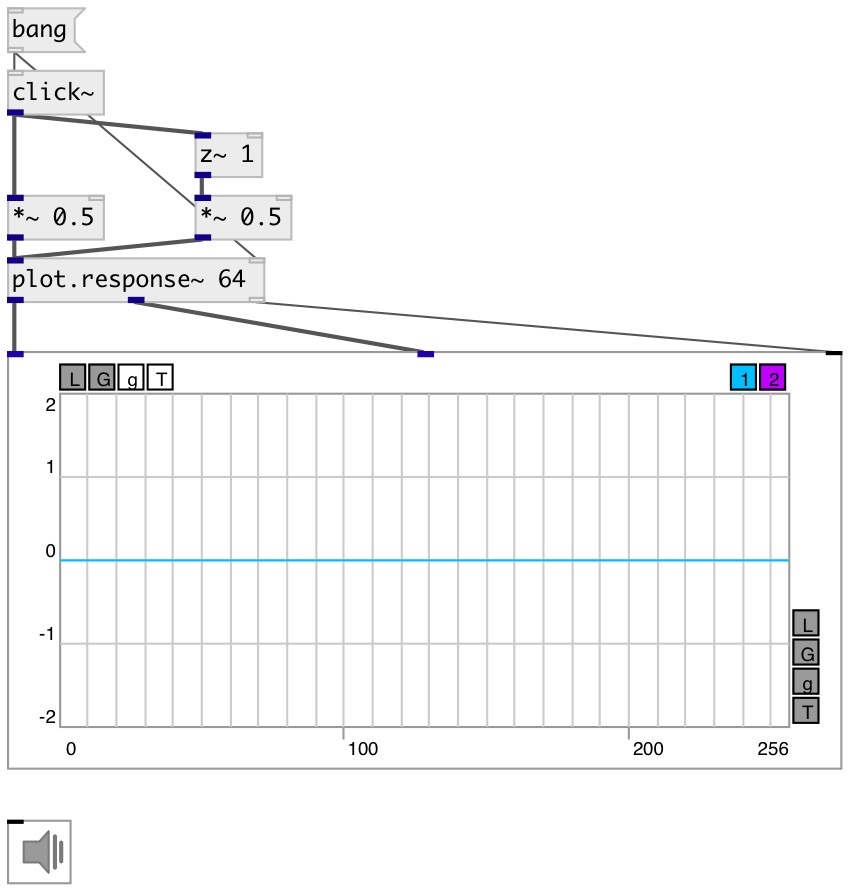

[index](index.html) :: [base](category_base.html)
---

# z~

###### sample delay

*доступно с версии:* 0.9.5

---

## аргументы:

* **Z**
delay length 
_тип:_ int 
_единица:_ samp 

## свойства:

* **@z** 
Запросить/установить delay length 
_тип:_ int 
_единица:_ samp 
_диапазон:_ 0..512 
_по умолчанию:_ 1 

## входы:

* input signal 
_тип:_ audio
* set delay length 
_тип:_ control

## выходы:

* output signal 
_тип:_ audio

## ключевые слова:

[delay](keywords/delay.html)
[z](keywords/z.html)

**Авторы:** Serge Poltavsky

**Лицензия:** GPL3 or later

